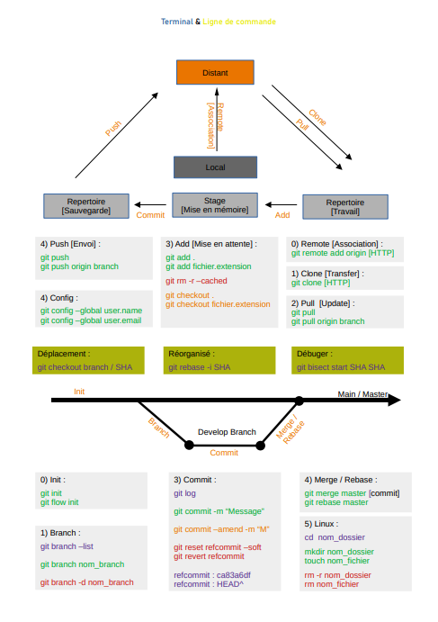

# GIT

---

Quand nous créons un projet de développement on initialise un projet Git.

Git permmet d'intéragir avec un gestinnaire de version comme Github ou Gitlab. Il nous sert à évitez les pertes, mais également travailliez à plusieurs sur un projet, il existera une version local du projet (votre ordinateur) et une version distante sur un serveur( Github ou GitLab)

---



## Commande de configuration

Pour configurer git suite à sont installation

Identity :

```code
git config --global user.name "votre_nom_git"
git config --global user.email email@exemple.com
```

Merge :

```code
git config --global core.editor "C:\paths\visua\VSC.exe -w"                     // Votre editeur de code
git config --global merge.tool "C:\paths\visua\VSC.exe -w"                      // Votre editeur de merge
```

Verification :

```code
git config –-list
```

---

## Commande de projet

### Initialisation Git

Lors de la création d'un projet on fait une _initialisation Git_ dans le repertoire du fichier.

```code
git init                    // Initialisation avec une branche main
git flow init               // Initialisation avec plusieurs branch dev
```

### Gitignore

On créer également un fichier .gitignore et README.md :

GITIGNORE contient les fichiers ne devant pas etre envoyer sur Github ou Gitlab
README permet de décrit le projet en langage MARKDOWN.

```code
touch .gitignore            // Ajouter nom_fichier.extension dans votre fichier .gitignore pour ignorer ce fichier.
touch README.md
```

### Branche & Déplacement

Le workflow de branche de fonctionnalité suppose l'existence d'un dépôt centralisé, et la branche main représente toujours l'historique officiel du projet.

Au lieu de faire des commits directement sur leur branche main locale, les développeurs créent une branche dès qu'ils commencent à travailler sur une nouvelle fonctionnalité. Les branches de fonctionnalité doivent avoir des noms descriptifs, comme « animated-menu-items » ou « issue-#1061 ».

```code
GIT :
git branch name_branch                  // Permet de crée une branche
git checkout name_branch                // Permet de changer de branche
git merge name_branch_fusion            // Permet de fussionner branch active avec la branch selectionner
git branch -d name_branch               // Permet de supprimer une branche
git branch –-list                       // Permet de visualiser les branches existantes

GITFLOW :
git flow nom_branch start <name>        // Permet de créer une fonction ou correctif
git flow nom_branch finish <name>       // Permet de finir une fonction ou correctif
git flow nom_branch publish <name>
git flow nom_branch track <name>
git flow nom_branch diff <name>
git flow nom_branch rebase <name>
git flow nom_branch checkout <name>
git flow nom_branch pull <name>
git flow nom_branch delete <name>

Production [main]                 // Branche de production, version actuelle du projet
Développement [develop]           // Branche de développement, centralise les fonctionnalités qui seront dans la prochaine version
Feature [name_function]           // Branche de fonctionnalité. Ont développera dans cette branche puis envoi RELEASE
Release [name_function]           // Branche de teste. Si test ok merge DEVELOP sinon HOTFIX
Bugfix [name_request]             // Branche de correction bug en developpement
Hotfix branch [name_request]      // Branche de correction bug en production
Support branch []                 // Branche de support supplementaire
```

### Pré-sauvegarde

### Sauvegarde

### Envoie

### Communication avec GITHUB ou GITLAB

Commande de communication avec [Github] :

```code
git remote add nom_association [Adresse HTTP]                  // Permet d’associer repos local à un repos distant
git clone [Adresse HTTP]                                       // Permet de cloner le dépôt distant sur le dépôt local.
git pull                                                       // Permet de recevoir fichiers distant MAJ sur votre dépôt local.
git push nom_branch                                            // Permet d’envoyer vos fichiers sauvegarder sur le dépôt distant.
---
```
